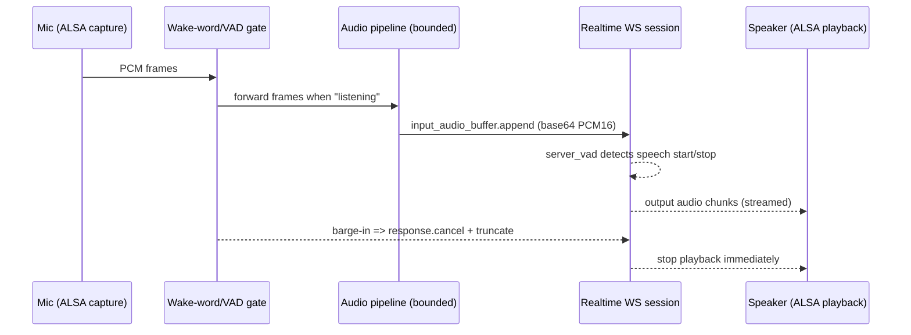

# ReachTether on Reachy Mini: Scalable Architecture Patterns for Real‑Time Multimodal .NET Apps

## Executive summary

ReachTether is positioned as a multi-project .NET codebase that targets (a) robot control through a reusable SDK, (b) an audio pipeline (PCM/WAV + ALSA), (c) WebRTC signaling/session support, and (d) a “voice-enabled prototype app” that chats via the Realtime API and speaks through Reachy audio, plus runnable samples like “ChattyReachyMini.” citeturn38view0

For the Reachy Mini wireless model, the device constraints and platform architecture strongly suggest an “edge media router / control client” design rather than a monolithic “everything everywhere” app:

- The robot’s media is already organized around a daemon-managed, multi-client media pipeline using GStreamer, with video shared via a Unix socket + WebRTC server, and audio exposed as named ALSA devices via `.asoundrc` to enable concurrent access. citeturn53search0turn53search5turn53search10  
- The robot’s compute is effectively a Raspberry Pi Compute Module 4 class system: quad-core Cortex‑A72 @ 1.5GHz, and your specific Reachy Mini controller variant is CM4104016 (Wi‑Fi, 4GB RAM, 16GB flash). citeturn48view0turn47view1  
- The daemon is explicitly meant to be a stable boundary responsible for hardware I/O and safety checks, exposing REST + WebSocket interfaces (useful for non‑Python controllers). citeturn49search1turn49search0  

Given those realities, the most maintainable scaling patterns for ReachTether on-device are:

- Treat audio/video ingestion, Realtime transport, and playback as **bounded, supervised streaming pipelines** (backpressure-first), not ad-hoc “async everywhere.” citeturn44search3turn44search0turn45search0  
- Build a small **conversation state machine** (wake → capture → commit → respond → barge-in) aligned with the Realtime event model (e.g., `input_audio_buffer.append/commit`, `response.create/cancel`, `conversation.item.truncate`, and server VAD events). citeturn52search4turn52search5turn52search0  
- Keep “skills/tools/RAG” logically separate from the hard real-time media code; run stateful knowledge and retrieval off-device with thin caching on-device, because 16GB flash (and ~2GB free in practice) is a tight operational envelope. citeturn48view0turn47view0  

A key gap: I could not reliably retrieve and read the repo’s nested source files (e.g., `dotNet/src/*`) via the available repository rendering pathways in this session, so I can’t quote or cite specific file-level implementations (buffering loops, WebSocket framing code, exception handling blocks). I can still deliver a rigorous, device-appropriate architectural analysis grounded in your repo’s public structure and the primary platform docs, and I’ll describe “what to look for” as concrete refactor checkpoints tied to the Reachy + Realtime realities. citeturn38view0turn53search0turn52search4  

## Reachy Mini platform constraints that shape architecture

The Reachy Mini hardware stack is not a generic Linux box with unlimited headroom; it’s a robot with a defined media/control architecture and a relatively small embedded storage/compute profile.

The wireless Reachy Mini is controlled by a Raspberry Pi 4 Compute Module (controller board lists CM4104016: Wi‑Fi, 4GB RAM, 16GB flash) and provides a USB‑C output port intended for connecting devices like a USB key (but it does not charge via that port). citeturn48view0 The underlying CM4 class spec is quad‑core Cortex‑A72 @ 1.5GHz and supports eMMC variants including 16GB. citeturn47view1turn47view0

The media stack is especially important for your “continuous audio + continuous video + barge-in” goals:

- On Reachy Mini wireless, video/audio streams are handled by the daemon, using GStreamer; the video stream is shared between a Unix socket and a WebRTC server, and the audio card is configured via `.asoundrc` with named endpoints `reachymini_audio_src` and `reachymini_audio_sink` to allow multiple applications to access audio. citeturn53search0  
- The project documentation also provides explicit GStreamer commands showing how to record from `reachymini_audio_src` and play to `reachymini_audio_sink`, and notes that `.asoundrc` must exist (a strong indicator you should target those logical devices rather than raw hardware ALSA endpoints to reduce locking/contention). citeturn53search5  
- In the Lite model, sounddevice can lock the audio card during playback, which is a concrete example of why “exclusive handles” can ruin complex apps if you don’t architect the media ownership model explicitly. citeturn53search0  

Audio on the wireless model is not just “a microphone”: the 4‑mic array is based on Seeed reSpeaker XMOS XVF3800; it provides audio output, and by default performs acoustic echo cancellation (AEC) so the robot doesn’t “hear itself.” It appears as `Pollen Robotics Reachy Mini Audio` and is tuned via `alsamixer`; it outputs stereo rather than raw 4‑channel mic feeds. citeturn53search1turn48view0

Finally, robot control and safety is daemon-centered. Reachy Mini uses a client-server architecture where the daemon handles hardware I/O and safety checks and exposes REST (`localhost:8000`) and WebSocket APIs. citeturn49search1turn49search0 The docs show that heavy CPU load can degrade motor control loop timing (nominally ~50Hz, ~20ms period), which is a direct architectural warning: any on-device continuous media/AI workload must be bounded and monitored to protect the robot control loop and overall responsiveness. citeturn49search2  

image_group{"layout":"carousel","aspect_ratio":"16:9","query":["Reachy Mini robot Pollen Robotics","Raspberry Pi Compute Module 4 board","Seeed reSpeaker XMOS XVF3800 microphone array","Reachy Mini microphone array board"],"num_per_query":1}

## ReachTether and the target app architecture

From the repository’s public structure, ReachTether is already decomposed into the right *kinds* of modules (robot SDK, audio pipeline, WebRTC support, and an app layer). citeturn38view0 The risk isn’t “too many projects” per se; it’s *where the boundaries are drawn* and *whether all real-time pathways are bounded, observable, and cancelable*.

A scalable architecture for your specific problem space (wake word + continuous streaming + Realtime + video snapshots + skills + RAG + robot control) generally needs three planes:

- **Plane A — Real-time media plane (hard real-time-ish):** capture, resample, frame, queue, play-out; designed for bounded latency and bounded memory.  
- **Plane B — Conversation/session plane:** the state machine aligning user intent, wake-word gating, Realtime events, barge-in, and turn/timeout policy. This plane consumes/produces events; it should *not* do raw device I/O. citeturn52search4turn52search0  
- **Plane C — Skills/tools/RAG plane:** retrieval, summarization, tool execution, robot behaviors; can be slower, remote, cached, and retried. The daemon already supplies a safe robot boundary (clamping/safety checks), so your app should avoid mixing “robot safety” concerns into media code. citeturn49search1  

Because I cannot access the underlying C# source files here, I can’t point to concrete anti-patterns *in your code*, but I can list concrete refactor checkpoints that are nearly always the difference between “manageable” and “chaotic” codebases in this exact category:

- **Unbounded queues anywhere in the audio/video hot path** (e.g., `ConcurrentQueue<byte[]>` without a cap, `Channel.CreateUnbounded` for PCM frames, or “store everything until we need it”) will eventually translate into GC pressure, latency spikes, and difficult-to-debug “robot got sluggish” reports. Prefer bounded channels with explicit full policies (wait vs drop). citeturn44search3turn44search4  
- **Per-chunk allocations** (new byte arrays per 20ms frame, per WebSocket message, per Base64 conversion) are a common hidden tax on ARM. Refactor toward buffer pooling (`ArrayPool<T>`) and “work on spans/memory” style APIs wherever possible. citeturn45search7turn45search4  
- **Task-per-frame or callback chains without supervision** (“fire-and-forget” async) makes barge-in and shutdown correctness very hard. Refactor toward a small number of long-lived, hosted background loops that own their resources and accept a `CancellationToken` from the host. citeturn45search0turn45search8  
- **Cross-cutting concerns entangled with media loops** (robot commands mixed into ALSA callbacks, RAG calls triggered inline in audio receive, etc.) becomes untestable. Refactor to push messages/events into the conversation plane and let a policy layer decide what to do next. The Realtime event model is naturally event-driven; mirror that internally. citeturn52search1turn52search4  
- **Hidden “ownership” of ALSA devices** (multiple parts of the app opening the capture device independently) is a failure mode on Reachy Mini and especially on Lite where sounddevice locking is explicitly called out. The architecture should make audio ownership obvious: one capture owner, one playback owner, other components consume a stream abstraction. citeturn53search0turn53search10  

A practical “north star” is: the media plane produces timestamped frames; the conversation plane is deterministic and testable off-device by feeding recorded frame sequences; the skills plane can be integration-tested separately.

## Integration options and tradeoffs

Your current direction—direct ALSA capture/playback + direct WebSocket-based Realtime audio—is a legitimate architecture when you (a) need a server-to-server style integration and (b) can’t rely on WebRTC in .NET on that target. The OpenAI docs explicitly position WebSocket as a good server-to-server approach and recommend WebRTC for browser/mobile clients. citeturn52search1turn52search6

The Reachy Mini documentation, meanwhile, indicates the robot-side media streaming is already supported through a daemon-managed GStreamer pipeline, with remote access via WebRTC and local access paths (Unix socket / ALSA logical devices). citeturn53search0turn53search5 That yields three realistic integration patterns:

| Option | What you’re “owning” | Latency characteristics | Implementation effort | Maintainability | Typical failure modes |
|---|---|---|---|---|---|
| Direct ALSA + Realtime WebSocket | Full mic capture, buffering, VAD/wake policy, Realtime event loop, audio output | Potentially low, but depends on buffering choices and Base64 overhead; fully under your control citeturn52search1turn52search5 | Medium (audio + WS + policy) | High *if* bounded pipelines and supervised services are used; low if ad-hoc async | ALSA device contention; queue blowups; drift between capture/playback clocks; hard-to-debug cancellation & barge-in logic citeturn53search5turn44search3turn52search4 |
| WebRTC gateway (your app terminates WebRTC) | ICE/DTLS/SRTP/media negotiation + encoding/decoding + audio/video devices | Best-in-class interactive latency when done right; but hard to do right on embedded | High | Medium to low (WebRTC complexity is large surface area) | Codec / device integration gaps (esp. on Linux); NAT/firewall issues; threading and timing sensitivity citeturn50search3turn51search0 |
| Daemon-mediated media (consume Reachy’s exported media) | Treat Reachy daemon/GStreamer as the media server; your app is a client | Latency is constrained by daemon pipeline, often “good enough” and avoids duplicating work | Medium (depends on access path) | High (you align with vendor architecture) | Access path gaps (e.g., Unix socket path not documented); WebRTC client complexity if you must terminate; contention if you bypass `.asoundrc` endpoints citeturn53search0turn49search0turn53search5 |

A nuance: the optimal choice is often *hybrid*. For example, keep audio via ALSA logical devices (`reachymini_audio_src/sink`) and treat video as “snapshots” via a daemon-compatible capture path, rather than attempting full continuous WebRTC video ingest into .NET. Reachy’s own docs emphasize the daemon’s streaming model and multi-app access patterns; fighting that tends to create brittle systems. citeturn53search0turn49search1  

## .NET patterns for resilient streaming pipelines

This section focuses on patterns that stay maintainable as you add: wake-word + continuous audio, Realtime barge-in, snapshot image turns, skills, and retrieval.

The core principle is: **use bounded, explicit concurrency and supervised lifetimes**. In .NET terms, that usually means “Generic Host + HostedServices + bounded Channels (or Dataflow) + pooled buffers.” citeturn45search0turn44search3turn45search7

### A minimal sequence diagram for the audio loop with barge-in



citeturn52search4turn52search0turn52search5

### Recommended .NET building blocks and why they matter

- **Generic Host** gives you one place for configuration, DI, and graceful shutdown. It calls `IHostedService.StartAsync`/`StopAsync` and provides an app lifetime boundary—exactly what you need for “always-on” device apps. citeturn45search0turn45search1  
- **System.Threading.Channels** provides a first-class async producer/consumer queue, including bounded modes where writers wait (backpressure) or drop items intentionally when full. This is the heart of stable continuous streaming. citeturn44search3turn44search4  
- **System.IO.Pipelines** is designed for high-performance streaming I/O and explicitly calls out backpressure/flow control mechanics. It’s a strong choice for WebSocket framing and “parse while reading” patterns. citeturn44search0  
- **Span<T>/Memory<T> guidelines + pooling** prevent “death by allocations.” You can work on spans for synchronous hot loops and pool arrays for frame buffers and Base64 staging. citeturn45search4turn45search7  
- **Cooperative cancellation** is not optional. Barge-in is fundamentally a cancellation problem, and the .NET cancellation model is designed for exactly this: link tokens, respond quickly, treat `OperationCanceledException` as control flow rather than “error.” citeturn45search8  

### Concise pseudo-code patterns

#### Producer/consumer with bounded Channels + pooled buffers

```csharp
// A "frame" is a pooled byte[] containing e.g. 20ms of PCM16 mono @16kHz (640 bytes).
// Keep it small and constant-size to simplify timing.

var frames = Channel.CreateBounded<PooledBuffer>(new BoundedChannelOptions(capacity: 200)
{
    FullMode = BoundedChannelFullMode.DropOldest, // prefer recency for realtime
    SingleWriter = true,
    SingleReader = false,
});

async Task CaptureLoop(CancellationToken ct)
{
    while (!ct.IsCancellationRequested)
    {
        var buf = PooledBuffer.Rent(size: 640); // wraps ArrayPool<byte>
        int bytes = alsa.Read(buf.Memory);      // native or wrapper call, blocking read

        if (bytes <= 0) { buf.Dispose(); continue; }

        buf.Length = bytes;
        if (!frames.Writer.TryWrite(buf))
        {
            // DropOldest will drop internally; but if TryWrite fails in your mode:
            buf.Dispose();
        }
    }
}

async Task RealtimeSendLoop(CancellationToken ct)
{
    await foreach (var buf in frames.Reader.ReadAllAsync(ct))
    {
        // Encode or chunk as needed. Prefer batching several frames to reduce WS overhead.
        websocket.SendInputAudioAppend(buf);
        buf.Dispose();
    }
}
```

citeturn44search3turn44search4turn45search7

#### Wake-word gating + “continuous capture, conditional forward”

```csharp
volatile bool isAwake = false;

async Task WakeGateLoop(CancellationToken ct)
{
    await foreach (var frame in frames.Reader.ReadAllAsync(ct))
    {
        if (!isAwake)
        {
            if (wakeWord.Detect(frame))
            {
                isAwake = true;
                // Optionally: clear/reseed downstream buffers to align turn start
                realtime.SendSessionUpdate(turnDetection: "server_vad");
            }
            frame.Dispose();
            continue;
        }

        forwardToRealtime.Writer.TryWrite(frame); // different bounded channel
    }
}
```

This matches the Realtime model: you can keep audio capture continuous, but decide when to commit/trigger responses based on your wake/turn policy. citeturn52search4turn52search2

#### Barge-in handling aligned to Realtime events

```csharp
// When user starts speaking while the model is talking, you must stop playback
// and cancel/truncate the model response.

void OnServerEvent(dynamic evt)
{
    switch ((string)evt.type)
    {
        case "input_audio_buffer.speech_started":
            audioPlayback.StopImmediately();         // stop ALSA sink writes
            realtime.SendResponseCancel();           // response.cancel
            realtime.SendConversationTruncate();      // conversation.item.truncate (remove unplayed audio)
            break;
    }
}
```

This is directly aligned with the Realtime “push-to-talk / interruption” guidance: cancel the in-progress response and truncate any unplayed audio so future context matches what the user actually heard. citeturn52search4turn52search0turn52search1  

## WebRTC failure modes and practical workarounds on ARM/ALSA

Your experience (“WebRTC via SIPSorcery failed”) is consistent with the reality that, in .NET, WebRTC isn’t one problem—it’s (a) signaling, (b) ICE, (c) SRTP/DTLS, *and* (d) media device + codec integration.

The SIPSorcery documentation is explicit that the core library does not provide cross-platform access to audio/video devices or native codecs, and that this is a major undertaking. Its “getting started” examples lean on Windows-specific media wrappers (and separate media repos). citeturn50search3turn50search5 That gap is exactly where ARM Linux deployments tend to stumble: even if signaling works, the media pipeline may not.

Given Reachy Mini’s architecture, three pragmatic workarounds stand out:

- **Use GStreamer as your WebRTC/media layer, keep .NET as orchestration.** Reachy Mini already uses GStreamer for media; GStreamer’s `webrtcbin` implements much of the W3C PeerConnection model, and the broader `rswebrtc` tooling (`webrtcsink`) exists specifically to simplify “serve fixed streams to many consumers” scenarios. citeturn51search0turn51search4turn53search0  
- **Use Reachy’s daemon-exported ALSA logical devices instead of raw ALSA hardware endpoints.** The docs show explicit concurrent record/play tests against `reachymini_audio_src/sink`, and the platform provides `.asoundrc` tooling with dmix/dsnoop semantics to support multi-client access. This is a direct mitigation for “audio device locking.” citeturn53search5turn53search10turn53search0  
- **If you truly need native WebRTC, consider a native library and wrap it.** `libdatachannel` is a standalone WebRTC implementation in C++ with C bindings supporting Linux and optional media transport; it is explicitly designed to avoid importing Google’s full stack. This is non-trivial, but it’s often more viable than forcing a C#-only WebRTC stack to do cross-platform media. citeturn50search0turn50search2  

### Extracting audio/video from the Reachy daemon without fighting locks

For **audio**, the docs provide the most straightforward story:

- Use ALSA source `reachymini_audio_src` and sink `reachymini_audio_sink` (they exist because the system configures `.asoundrc` for multi-app access). citeturn53search0turn53search5turn53search10  
- Rely on the onboard echo cancellation (AEC) in the XVF3800 pipeline when doing full duplex speech interactions (robot speaks while listening), rather than implementing your own AEC. citeturn53search1  

For **video**, the doc-made options are:

- If you can accept “snapshots” rather than continuous video: use the platform camera tooling (`rpicam-*`) or a daemon-compatible GStreamer pipeline using `libcamerasrc` (the docs show how the SDK configures it and how to inspect its parameters). citeturn53search1  
- If you need continuous streaming: the daemon architecture indicates video is shared via Unix socket and WebRTC server. If a stable socket path is available in the daemon implementation, the maintainable approach is to connect to that export rather than directly opening the camera device from multiple processes. citeturn53search0turn49search1  

For **robot state/control**, the daemon has a clean story for non-Python clients: REST endpoints like `GET /api/state/full` plus WebSocket `ws://localhost:8000/api/state/ws/full` are explicitly documented. citeturn49search0turn49search1  

## Storage, RAG, operations, and a prioritized roadmap

### Storage and RAG under a tight on-device budget

Reachy Mini’s wireless controller board is specified as 16GB flash (CM4104016) and supports connecting a USB key via its USB‑C output (not for charging). citeturn48view0turn47view0 If you only have ~2GB free, assume you’re effectively in a “thin edge node” profile:

- Keep **long-term knowledge** (vector store + documents) off-device and treat the robot as a client with a small local cache.  
- Use **two-tier memory**: (1) short-term conversation state on-device, (2) periodic summarization + embedding off-device, returning only compact “working sets” to the robot. The Realtime API explicitly supports multimodal inputs/outputs, but you want those heavy assets stored remotely and referenced by IDs/URLs rather than mirrored locally. citeturn52search6  
- On-device caching should be **bounded and disposable** (e.g., “last N minutes” audio transcripts, last N snapshots, last N tool results), and the cache manager should be able to reclaim space aggressively when disk pressure rises.

### Observability, restart strategy, and safe control arbitration

For device software that mixes real-time media, networking, and robot control, “it works” is not enough—operational stability is a feature.

- Adopt **OpenTelemetry-style instrumentation** at the boundaries (capture → enqueue → send → model events → playback) using `ActivitySource` (traces) and `Meter` (metrics). Microsoft’s guidance emphasizes that .NET already provides the core APIs, and OpenTelemetry collects/exports them. citeturn44search5turn44search7  
- Add metrics for: queue depth, dropped frames, audio underflows, WS reconnect count, daemon state WS lag, and motor loop health (the troubleshooting docs show you can check daemon control loop period and that it should be ~20ms). citeturn49search2turn49search0  
- Treat the Reachy daemon as the **arbiter of physical safety**: the docs describe safety limits and clamping in the SDK/architecture. Your app should avoid bypassing those guardrails with “direct motor commands” outside the daemon model. citeturn49search1  

### Prioritized actionable roadmap

| Phase | Actions (most important first) | Effort | Risk |
|---|---|---:|---:|
| Short-term stabilization | Put all capture→send pipelines behind **bounded channels**; enforce “single owner” for ALSA capture/playback; implement deterministic barge-in (`response.cancel` + `conversation.item.truncate`) tied to `input_audio_buffer.speech_started`; add basic metrics/logging around queue depth and reconnects. citeturn44search3turn52search4turn53search5 | 2–5 days | Medium |
| Medium-term refactor | Recast the app as **Generic Host** with supervised `BackgroundService`s: AudioCapture, AudioPlayback, RealtimeSession, DaemonStateClient, SkillsOrchestrator; define internal event contracts; add integration tests using recorded PCM streams and mocked Realtime event streams; isolate RAG client behind an interface with a small local cache. citeturn45search0turn45search1turn44search3 | 2–4 weeks | Medium |
| Long-term architecture | Decide on a stable video strategy: snapshots-only vs continuous streaming; if continuous is required, move video ingest to a daemon/GStreamer-aligned export or a dedicated gateway process; formalize “skills” as plugins with versioned contracts; add end-to-end telemetry and watchdog restarts; validate behavior under CPU pressure and enforce load shedding to protect robot control loop timing. citeturn53search0turn53search1turn49search2 | 1–3 months | Medium–High |

### Recommended libraries/tools and what each is for

| Tool / Package | Best use in ReachTether | Why it fits |
|---|---|---|
| entity["company","OpenAI","ai research company"] Realtime API (WebSocket) | Server-to-server Realtime transport from the robot | WebSockets are positioned as a good server-to-server choice; you explicitly manage audio chunks/events. citeturn52search1turn52search5turn52search4 |
| .NET Generic Host + HostedServices | Process lifetime, DI, clean shutdown, supervised workers | Designed for app startup/lifetime management and hosted background services. citeturn45search0turn45search1 |
| System.Threading.Channels | Bounded producer/consumer between capture, VAD, network, playback | First-class async producer/consumer with bounded backpressure/drop policies. citeturn44search3turn44search4 |
| System.IO.Pipelines | High-performance streaming I/O (e.g., WebSocket framing, parsers) | Built to reduce boilerplate and provide flow control/backpressure. citeturn44search0 |
| ArrayPool + Span/Memory | Reduce allocations in frame hot paths | Pooling is a standard approach for perf-critical allocations; Memory/Span guidelines highlight correct usage patterns. citeturn45search7turn45search4 |
| GStreamer `webrtcbin` / `webrtcsink` | “Gateway” approach for WebRTC if needed | Implements PeerConnection-like model and provides WebRTC building blocks; aligns with Reachy’s own media stack. citeturn51search0turn53search0turn51search4 |
| `libdatachannel` | Native WebRTC baseline if you must terminate WebRTC on-device | Lightweight C/C++ WebRTC implementation with Linux support and media transport capability. citeturn50search0turn50search2 |
| entity["organization","SIPSorcery","dotnet webrtc library"] | WebRTC signaling experiments and certain .NET RTC cases | Core library notes device/codec access isn’t provided by default; media support is a separate concern (often Windows-targeted). citeturn50search3turn50search5 |
| OpenTelemetry (.NET) | End-to-end observability (traces/metrics/logs) | Establishes standard collection/export; .NET uses `ActivitySource`/`Meter`/`ILogger`. citeturn44search5turn44search7 |
| entity["company","Hugging Face","ai platform company"] daemon REST/WS API | Robot state/control integration from .NET | Explicitly documented REST + WebSocket endpoints for full state and non-Python controllers. citeturn49search0turn49search1 |

### Final perspective on scalability and maintainability

The patterns above *are* scalable for maintainable device code—but only if you treat bounded concurrency, explicit ownership of scarce resources (ALSA devices, CPU budget), and supervision (hosted services with cancellation) as non-negotiable foundations. Reachy Mini’s own architecture (daemon-managed media; multi-client audio via `.asoundrc`; REST/WS daemon boundary with safety checks) is a strong hint: align your app architecture with those boundaries rather than trying to collapse everything into one undifferentiated “async blob.” citeturn53search0turn49search1turn53search10